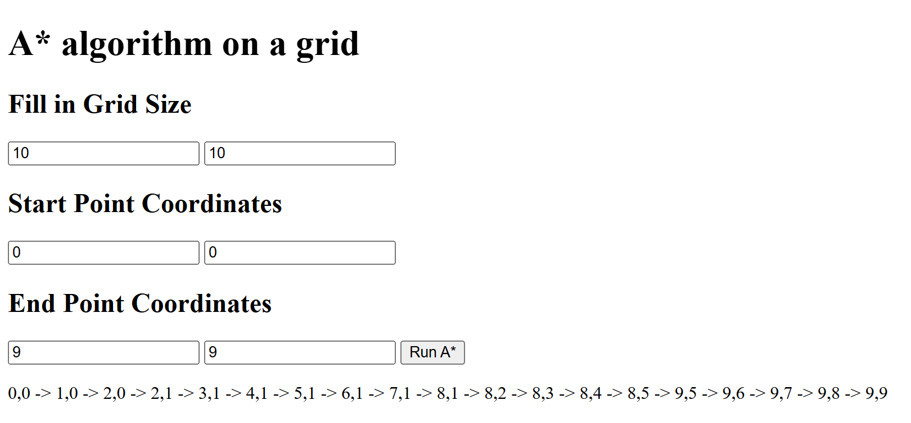

# A* Simulator - Web Based Interface

Web Interface that takes in inputs for grid size, starting cordinates, and ending coordinates.
Created with JavaScript and HTML.

---

## Features
- Customizable Grid Size: takes user inputs for domain and range. Negative values not currently supported.
- Start and End Coordinates: Takes in user input for x,y coordinates. User chooses start and end points on grid.
- Manhattan Distance: A shortest path in Manhattan geometry (up, down, left and right directions) is displayed.
  
---

## Web-Based Interface
Preview

