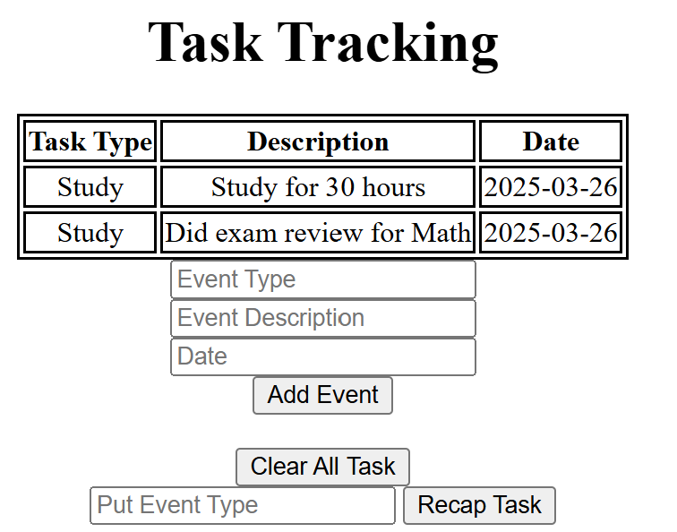

# Task Tracker - Command Line Input and Web-Based Interface

Command line tool that tracks tasks. Also has web-based interface version with same function. 
Stores tasks, tracks frequency of task within 7 days.  

---

## Features
- Add events with custom type, details, and date (defaults to today)
- Recaps frequency of events based on tasks input
- View events by dates
  
---

## How to Run
Command Line Input
```bash
python main.py add Run "Run 3 miles" 2025-03-25
python main.py add Run "Run 4 miles" 
python main.py view
python main.py recap Run
python main.py clear
```

## Web-Based Interface
Preview


